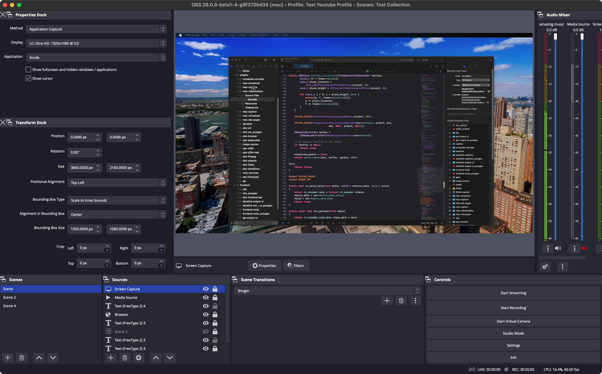

# Properties Dock for OBS Studio!

**Note: This plugin is not yet stable and should be used for testing purposes only.**

This is a plugin for OBS Studio which adds the Source Properties and Edit Transform windows as docks. This way, you can more easily see the effects of your changes live as it happens, making editing much more convinient.

Downloads for macOS and Linux are automatically generated by CI and can be found in the "Actions" section. Windows CI is disabled for now due to an issue.

This plugin is based on the [obs-plugintemplate](https://github.com/obsproject/obs-plugintemplate). For build instructions, please head there.
